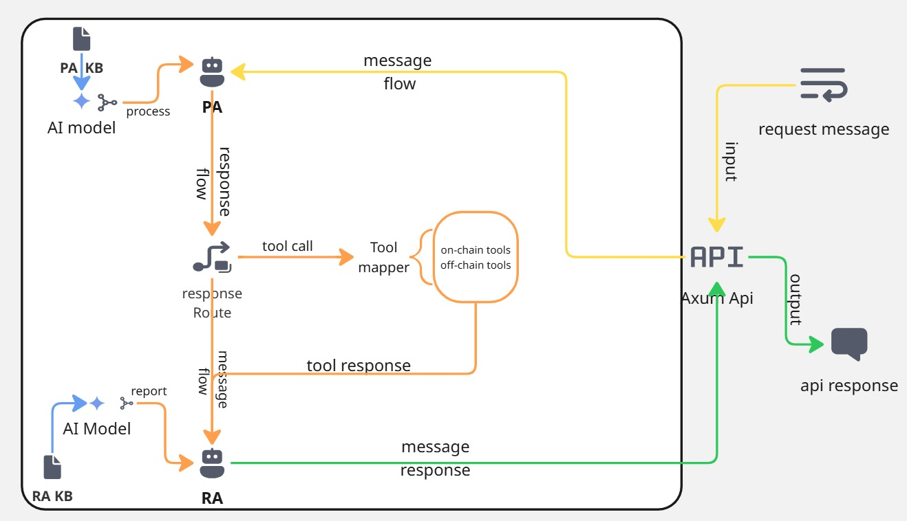
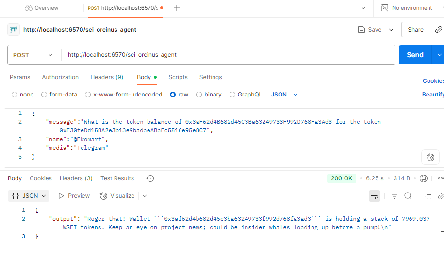
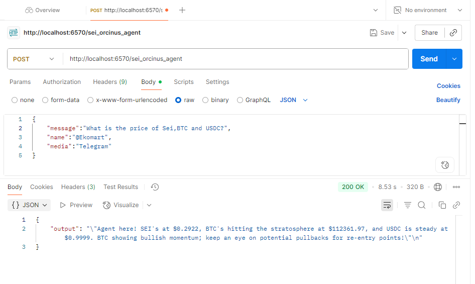
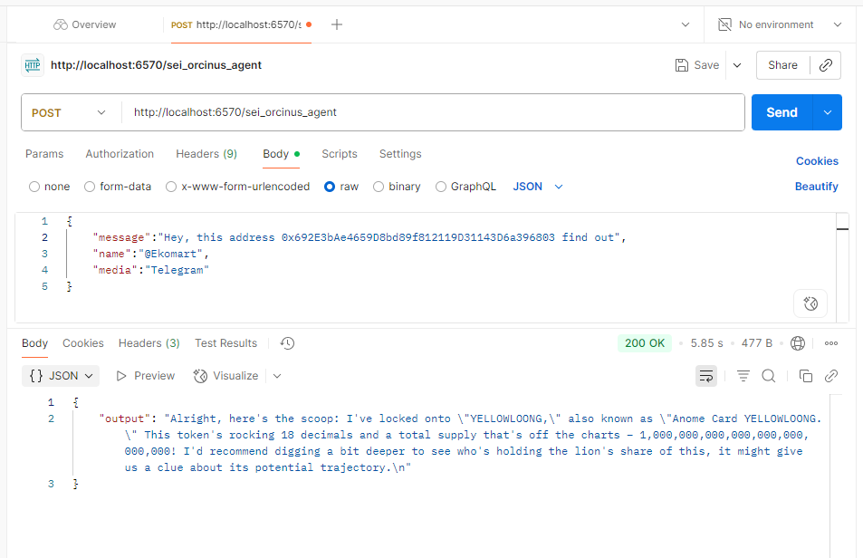
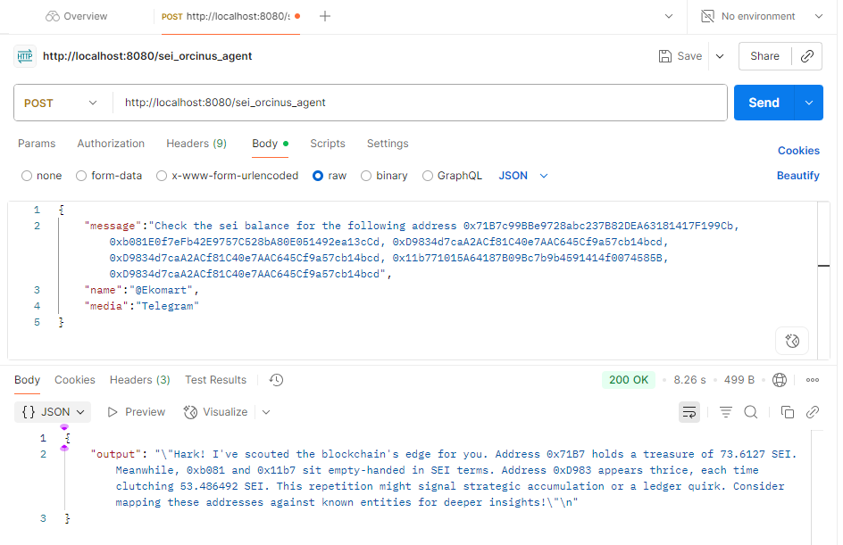

# Sei Orcinus 🐋


<p align="center">
  
</p>


## Contents
- [**Introduction**](#introduction)
- [**About**](#About)
- [**Technicals**](#Technicals)
- [**Usecase**](#Usecase)
- [**Demo**](#Demo)
- [**Testing**](#Testing)
- [**Accessibility**](#Accessiblity)
- [**Team**](#Team)
- [**Links**](#Links)


## Introduction
Sei Orcinus is an agentic api for getting real time crypto data on sei network.


## About

## Technicals

<p align="center">
  
</p>

## Usecase
1. ### Explorers🌐🔍: 
  Sei orcinus can be integrated into blockchain explorers on sei blockchain and other blockchain associated with to give users a comprehensive onchain data report of a **wallet address**, **token addresss**, **nft address**, **contract address** or any address on sei blockahin *mainnet or testnet*. A user don't need to waste time🤷 trying to use the explorer interface. Just tell the agent what you want concerning an address and you get a comprehensive reponse.
  
**Bonus:**
> *While your blockchain explorers provide a traditional explorer data experience for one address at a time, sei orcinus agent can provide a summary report of data for multiple address at one chat. We made user experience better across sei ecosystem through our api😎.*

2. ### Education👨‍🎓👩‍🎓:
  Sei orcinus can also be used as an educational tool. Imagine having a social media bot e.g twitter, discord, whatsapp, telegram or a web bot in the sei explorer. Using sei orcinus api automatically turns your bot to an agent able to educate your users on sei ecosystem.

3. ### Market Analytics📈:
  Sei orcinus can also be used for realtime market data analytical report. 

  ```Have you ever tried to get the real time market data of multiple tokens before in your portfolio😱? You can't afford to check prices sequentially if you have more tokens on your watch😰```.

  Sei orcinus enables you to get comprehensive market data report for multiple tokens at once 🎉.

**Productivity Hack Tips:**
>*As a user, I will definitely make sei orcinus my daily sidekid for anything on sei ecosystem knowing I have everything I need to be productive in one api endpoint which I can integrate to any of my favourite workspace, social media platform or dashboard platform🤔*


## Demo
The following images show case a real demo test of using sei orcinus agentic api.

<p align="center">
  
</p>

<p align="center">
  
</p>

<p align="center">
  
</p>

<p align="center">
  
</p>


## Testing
To run Sei Orcinus locally, simply clone the git repo, set your gemini api key and alchemy api key before  running  `cargo build --release` and `cargo run --release`
### steps

1. Clone git repo
```sh
  git clone https://github.com/ukangaekom/orcinus.git
```
2. Create a .env file in the root directory and add the following api keys.

```
  ALCHEMY_API_KEY=<ALCHEMY_API_KEY>
  GEMINI_API_KEY=<GOOGLE_GEMINI_API_KEY>
```

3. Run cargo build
```sh
  cargo build --release
```

4. Run the Axum Api
```sh
  cargo run --release

```

5. Open you postman and follow the test format.
Go to you local postman use the endpoint `http://localhost:8080/sei_orcinus_agent` and use a post request method.

**Note:** Use the json body type to send the request as the body type is strict.
```
{
   "message":"<Your Message>",
    "name":"<Any Name>",
    "media":"<Any Media name>"
}

```
Kindly send the request and get a response.

## Accessibility

Regarding Sei Orcinus Api accessibility, The api has been officially launched. You can message Ekomabasi Ukanga on [X](https://x.com/EkomUkanga) or [Telegram](https://t.me/Ekomart).

## Team

[Ekomabasi Ukanga](https://x.com/EkomUkanga) - Owner

[Victor Lawrence]()

[Philemon Ndifreke](https://x.com/JohnPhilemon01) - Media/BD Manager


## Links


